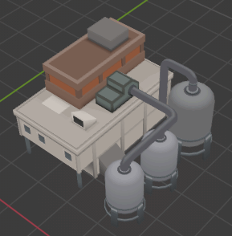
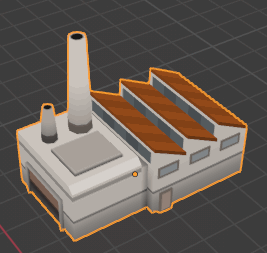

# Models

This directory contains the models for games. The models are created using [Blender](https://www.blender.org/). Only one texture is used for all models, which is a 256x256 texture containing a palette based on the [DB32](https://lospec.com/palette-list/dawnbringer-32) palette.

# License

Not sure yet. Contact me if you're interested.

## Buildings

